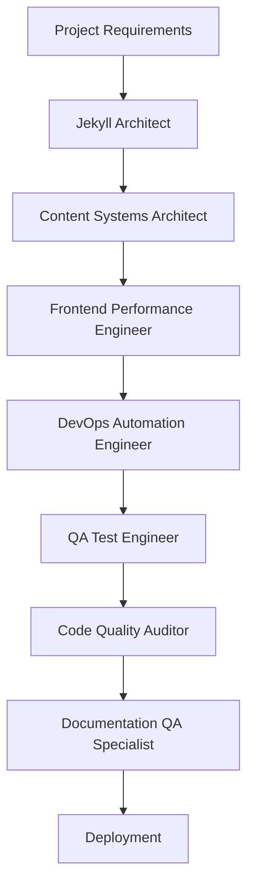
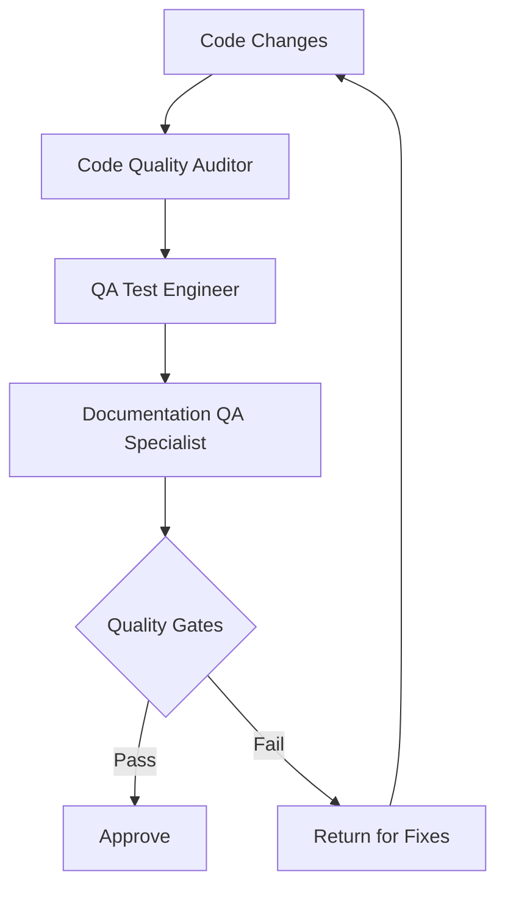
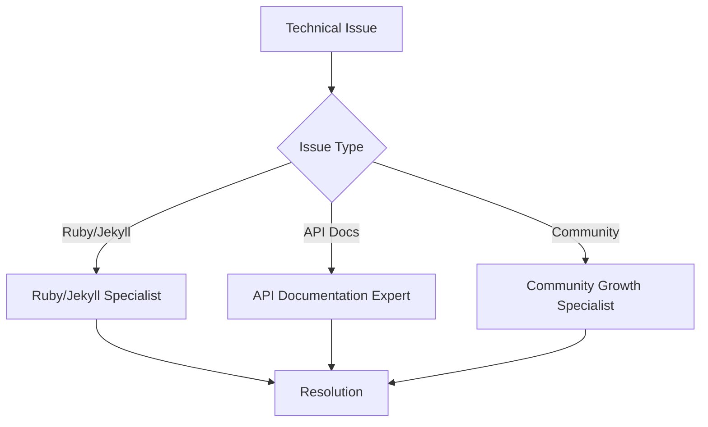

# Claude Code Sub-Agent Architecture Plan
## Lessons Learned from OSpec Website Refactoring

### Executive Summary

Based on the successful OSpec website refactoring that transformed a basic Jekyll site into a production-grade documentation platform, this plan outlines a comprehensive sub-agent architecture for future development projects. The agents are designed to replicate the expertise demonstrated in the OSpec transformation: architectural excellence, developer experience optimization, and production-grade quality.

## Key Lessons from OSpec Refactoring

### 1. **Multi-Disciplinary Excellence Required**
- **Frontend Architecture**: Jekyll optimization, responsive design, performance tuning
- **Content Strategy**: Progressive documentation, real-world examples, community engagement
- **DevOps Excellence**: CI/CD, testing automation, deployment optimization
- **Quality Assurance**: Link validation, YAML verification, HTML proofer integration

### 2. **Critical Success Factors**
- **Systematic Approach**: Structured todo tracking, phase-based implementation
- **Best Practices**: Industry-standard patterns, security considerations, SEO optimization
- **Developer Experience**: One-command setup, comprehensive documentation, automation
- **Scalability**: Architecture that supports 1000s of documents without degradation

### 3. **Technical Depth Required**
- **Configuration Management**: Jekyll, Ruby, Node.js ecosystems
- **Testing Strategy**: Unit, integration, end-to-end validation
- **Performance Optimization**: Asset compression, caching strategies, build optimization
- **Community Building**: Contributing guidelines, issue templates, documentation

## Proposed Sub-Agent Architecture

### **Tier 1: Specialized Development Agents**

#### 1. **Jekyll Architect** (`jekyll-architect`)
**Focus**: Jekyll site architecture, configuration, and optimization

**Tools**: `Read`, `Edit`, `MultiEdit`, `Glob`, `Grep`, `Bash`

**Responsibilities**:
- Jekyll configuration optimization (_config.yml)
- Plugin selection and configuration
- Collection and data structure design
- Performance optimization (Sass compression, caching)
- SEO configuration (meta tags, sitemaps, schema markup)

**Trigger Context**: Jekyll projects, static site generators, documentation sites

#### 2. **Frontend Performance Engineer** (`frontend-perf`)
**Focus**: Frontend optimization, responsive design, accessibility

**Tools**: `Read`, `Edit`, `Write`, `Bash`

**Responsibilities**:
- CSS optimization and responsive design
- JavaScript performance and loading strategies
- Image optimization and responsive images
- Accessibility (WCAG 2.1 AA compliance)
- Core Web Vitals optimization

**Trigger Context**: Frontend performance, CSS/JS optimization, mobile responsiveness

#### 3. **Content Systems Architect** (`content-architect`)
**Focus**: Content organization, navigation, and information architecture

**Tools**: `Read`, `Write`, `Edit`, `MultiEdit`, `Glob`

**Responsibilities**:
- Content taxonomy and organization
- Navigation design and UX patterns
- Progressive disclosure strategies
- Search and discoverability optimization
- Content templates and reusable components

**Trigger Context**: Documentation structure, content organization, navigation design

#### 4. **DevOps Automation Engineer** (`devops-engineer`)
**Focus**: CI/CD, testing automation, deployment optimization

**Tools**: `Write`, `Edit`, `Bash`, `Read`

**Responsibilities**:
- GitHub Actions workflow design
- Testing pipeline automation (HTML Proofer, link validation)
- Deployment strategies (GitHub Pages, CDN optimization)
- Environment configuration and secrets management
- Monitoring and analytics setup

**Trigger Context**: Deployment, CI/CD, automation, testing pipelines

### **Tier 2: Quality Assurance Agents**

#### 5. **QA Test Engineer** (`qa-tester`)
**Focus**: Comprehensive testing strategies and validation

**Tools**: `Read`, `Bash`, `Write`, `Grep`, `Glob`

**Responsibilities**:
- Test plan development and execution
- Automated testing setup (unit, integration, e2e)
- Cross-browser and device testing strategies
- Performance testing and benchmarking
- Security testing and vulnerability scanning

**Trigger Context**: Testing, validation, quality assurance, bug detection

#### 6. **Code Quality Auditor** (`code-auditor`)
**Focus**: Code review, best practices enforcement, standards compliance

**Tools**: `Read`, `Grep`, `Glob`, `Edit`

**Responsibilities**:
- Code review and quality assessment
- Best practices enforcement
- Security audit and vulnerability detection
- Performance code review
- Standards compliance verification (accessibility, SEO, performance)

**Trigger Context**: Code review, quality audit, best practices, security assessment

#### 7. **Documentation QA Specialist** (`docs-qa`)
**Focus**: Documentation quality, accuracy, and user experience

**Tools**: `Read`, `Grep`, `Glob`, `Edit`

**Responsibilities**:
- Documentation accuracy verification
- Link validation and maintenance
- Content consistency and style guide enforcement
- User experience testing for documentation
- API documentation validation

**Trigger Context**: Documentation review, content validation, user experience testing

### **Tier 3: Specialized Domain Experts**

#### 8. **Ruby/Jekyll Specialist** (`ruby-expert`)
**Focus**: Deep Ruby and Jekyll ecosystem expertise

**Tools**: `Read`, `Edit`, `Bash`, `Write`

**Responsibilities**:
- Ruby version management and compatibility
- Jekyll plugin development and customization
- Liquid templating optimization
- Ruby dependency management (Bundler, Gemfile)
- Jekyll theme development and customization

**Trigger Context**: Ruby issues, Jekyll plugins, Liquid templates, gem management

#### 9. **API Documentation Expert** (`api-docs-expert`)
**Focus**: API documentation, OpenAPI specs, interactive documentation

**Tools**: `Read`, `Write`, `Edit`, `MultiEdit`

**Responsibilities**:
- OpenAPI/Swagger specification design
- Interactive API documentation
- SDK documentation and examples
- API testing and validation documentation
- Developer onboarding experiences

**Trigger Context**: API documentation, OpenAPI, developer experience, SDKs

#### 10. **Community Growth Specialist** (`community-builder`)
**Focus**: Open source community building and engagement

**Tools**: `Write`, `Edit`, `Read`

**Responsibilities**:
- Contributing guidelines development
- Issue and PR template creation
- Community documentation and processes
- Onboarding experience optimization
- Engagement strategy and metrics

**Trigger Context**: Open source, community building, contributing guidelines

## Agent Coordination Workflows

### **Primary Development Workflow**



### **Quality Assurance Workflow**



### **Specialized Support Workflow**



## Agent Implementation Specifications

### **Development Agent Template**

```yaml
name: agent-name
description: |
  Detailed description of agent purpose, when to invoke,
  and expected outcomes. Include specific trigger keywords
  and contexts.
tools:
  - Read
  - Edit
  - MultiEdit
  - Bash
  - Grep
  - Glob
system_prompt: |
  You are a specialized [ROLE] agent with deep expertise in [DOMAIN].
  
  Your primary responsibilities:
  1. [Responsibility 1]
  2. [Responsibility 2]
  3. [Responsibility 3]
  
  Best Practices:
  - Always read existing code/configuration before making changes
  - Follow industry best practices and standards
  - Optimize for performance and maintainability
  - Document decisions and rationale
  
  Quality Standards:
  - Ensure all changes are production-ready
  - Test implementations thoroughly
  - Consider scalability and future maintenance
  - Follow security best practices
```

### **QA Agent Template**

```yaml
name: qa-agent-name
description: |
  QA specialist focused on [TESTING DOMAIN]. Automatically
  triggered for testing, validation, and quality assurance tasks.
tools:
  - Read
  - Bash
  - Grep
  - Glob
  - Write
system_prompt: |
  You are a Quality Assurance specialist focusing on [DOMAIN].
  
  Your testing methodology:
  1. Analyze requirements and acceptance criteria
  2. Design comprehensive test plans
  3. Implement automated testing where possible
  4. Execute manual testing for complex scenarios
  5. Report findings with clear reproduction steps
  
  Quality Gates:
  - All tests must pass before approval
  - Performance requirements must be met
  - Security vulnerabilities must be addressed
  - Documentation must be accurate and complete
  
  Failure Response:
  - Provide clear, actionable feedback
  - Include specific examples and recommendations
  - Suggest fixes and improvements
  - Re-test after fixes are implemented
```

## Success Metrics and KPIs

### **Development Efficiency**
- **Setup Time**: New projects operational in < 5 minutes
- **Build Performance**: < 30 seconds for full site builds
- **Deployment Speed**: < 2 minutes from commit to live
- **Error Rate**: < 1% broken links or validation errors

### **Quality Assurance**
- **Test Coverage**: > 90% for critical paths
- **Performance Score**: Lighthouse score > 95
- **Accessibility**: WCAG 2.1 AA compliance
- **Security**: Zero high/critical vulnerabilities

### **Developer Experience**
- **Documentation Completeness**: 100% of features documented
- **Onboarding Success**: New contributors productive in < 30 minutes
- **Community Engagement**: Response time to issues < 24 hours
- **Maintenance Overhead**: < 10% of development time

## Implementation Roadmap

### **Phase 1: Core Development Agents (Week 1-2)**
1. Jekyll Architect
2. Frontend Performance Engineer
3. Content Systems Architect
4. DevOps Automation Engineer

### **Phase 2: Quality Assurance Agents (Week 3-4)**
1. QA Test Engineer
2. Code Quality Auditor
3. Documentation QA Specialist

### **Phase 3: Specialized Domain Experts (Week 5-6)**
1. Ruby/Jekyll Specialist
2. API Documentation Expert
3. Community Growth Specialist

### **Phase 4: Integration and Optimization (Week 7-8)**
1. Agent coordination testing
2. Workflow optimization
3. Performance tuning
4. Documentation and training

## Risk Mitigation

### **Technical Risks**
- **Agent Conflicts**: Clear role boundaries and escalation procedures
- **Performance Degradation**: Resource monitoring and optimization
- **Tool Limitations**: Fallback procedures and manual intervention protocols

### **Process Risks**
- **Over-Engineering**: Regular review and simplification cycles
- **Quality Gate Bottlenecks**: Parallel processing and priority queues
- **Knowledge Silos**: Cross-training and documentation requirements

## Conclusion

This sub-agent architecture leverages the lessons learned from the successful OSpec refactoring to create a comprehensive, scalable system for future development projects. By combining specialized expertise with systematic quality assurance, we can consistently deliver production-grade results that match the excellence demonstrated in the OSpec transformation.

The architecture supports both simple projects (using core agents) and complex enterprise applications (utilizing all specialist agents), providing flexibility while maintaining quality standards. Each agent is designed with clear responsibilities, specific tool access, and measurable success criteria, ensuring consistent, high-quality outcomes across all development initiatives.